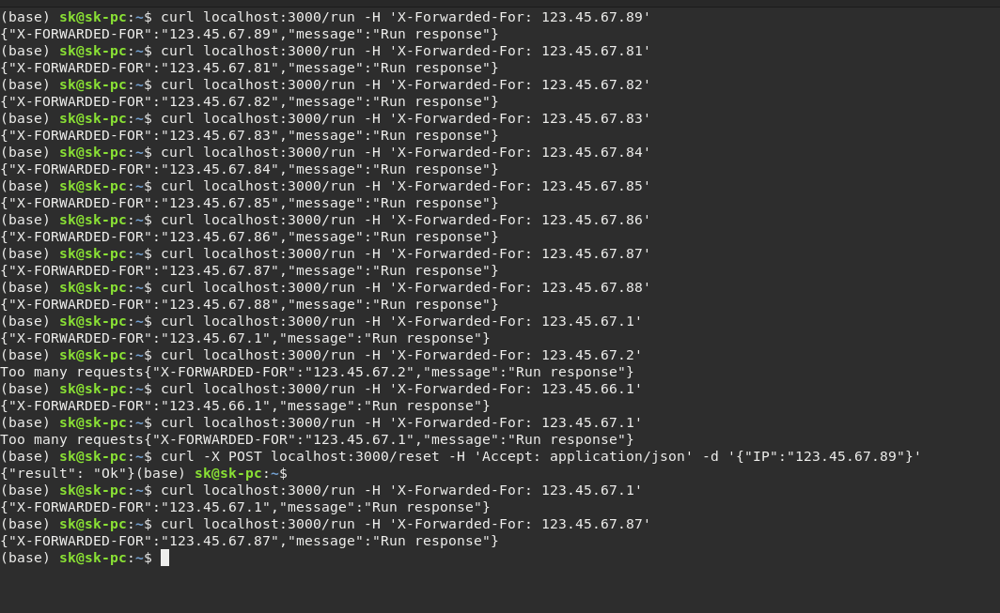

**Тестовое задание на позицию Golang разработчика.**

Необходимо создать HTTP-сервис, способный ограничивать 
количество запросов (rate limit) из одной подсети IPv4. 
Если ограничения отсутствуют, то нужно выдавать одинаковый статичный контент.

Требования:
язык: Go
код должен быть выложен на GitHub
ответ должен соответствовать спецификации RFC 6585
IP должен извлекаться из заголовка X-Forwarded-For

Параметры конфигурации:
подсеть: /24 (маска 255.255.255.0)
лимит запросов в минуту
время ожидания после ограничения

>Пример: после 20 запросов с IP 37.147.14.178 и 80 запросов с IP 37.147.14.1 
сервис возвращает 429 ошибку на любой запрос с подсети 37.147.14.0/24 в течение двух последующих минут.

**Дополнительно**:
- покрытие тестами
- контейнеризация, возможность запустить с помощью docker-compose up
- отдельный handler для сброса лимита по префиксу

**Описание запуска:**
 
`docker-compose up -d`

По-умолчанию сервер запуститься на 3000 порту.

Порт можно поменять в конфигурационном файле [port]: config/config.yaml

В этом же конфигурационном файле настройки лимитов.

>curl localhost:3000/run -H 'X-Forwarded-For: 123.45.67.89'
> 
>curl -X POST localhost:3000/reset -H 'Accept: application/json' -d '{"IP":"123.45.67.89"}'

Пример запуска:

Запуск тестов:

просто запуск тестов
>make test 

с покрытием и проверкой состояния гонки
>make test_coverage

как предыдущий, но выводит html что не покрыто
>make test_coverage-html

